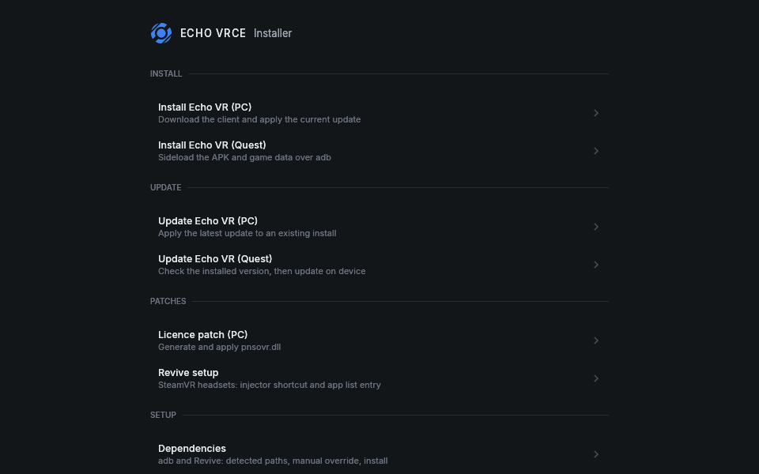

<div align="center">


[](https://github.com/echo-vrce/installer/actions)


**Installs, updates and sets up the community build of Echo VR, for PC and for Quest.**

</div>

---

Echo VR's official servers are gone. [EchoVRCE](https://discord.com/invite/echo-vr-lounge)
is the community that keeps the game playable, and this is a tool for getting it onto a
machine. It is a rewrite of
[marshmallow-mia's original installer](https://github.com/marshmallow-mia/Echo-VR-Installer),
in Rust with a native UI, talking to the same community infrastructure.



## What it does

- **Installs the PC client.** Picks the fastest mirror, downloads 4.68 GB with resume,
  verifies it, unpacks it, and applies the current update on top.
- **Updates an existing install.** Hashes what is on disk against the manifest and fetches
  only what actually differs. Safe to re-run.
- **Applies the licence patch** for people who never owned Echo VR on Meta, through the
  community's Discord bot.
- **Sideloads to a Quest** over `adb`, and updates it, checking first that the build on the
  headset is one the current manifest can be applied to.
- **Sets up Revive** so a SteamVR headset can launch the game: a desktop shortcut and an
  entry in Revive's app list.
- **Ships a command line** with the same engine behind it. Same operations, `--json`
  output, and exit codes a script can branch on.

Some things it deliberately does not do. Nothing is detected and acted on behind your back:
detection reports what it found, and every path stays a choice you make. Anything
irreversible names the exact folder and asks first. Every download can be stopped, and
stopping keeps what has arrived so far.

## Status

**Tested on real hardware**, not only in a VM: a full PC install carried through end to
end, an update against the live manifest, a Quest 2 sideload and update verified against
the headset's own logs, Revive setup, and the licence patch. The Quest flow has also been
run under Proton on Linux, which is what the OpenGL renderer is there for.

**It has not been tested widely.** A handful of machines and a small number of people:
Windows 10 and 11 on x86-64, plus the Proton run above. Expect rough edges on hardware and
configurations nobody has tried yet, and please report what you find rather than working
around it.

## Running it

Windows 10 or 11, 64-bit. About 10 GB free on the drive you install to, for a 4.68 GB
download plus the unpacked game.

Nothing else. The C runtime is linked statically, so there is no Visual C++ Redistributable
to install first. The program keeps its settings and logs in `%LOCALAPPDATA%\EchoVRCE` and
never needs administrator rights for itself, only for a step that writes somewhere that
does.

Optional, and fetched or found only when a flow needs them:

| For | You need | Where it comes from |
| --- | --- | --- |
| A Quest headset | `adb` | Downloaded from Google on request, into the app's own folder |
| A SteamVR headset | [Revive](https://github.com/LibreVR/Revive) | Downloaded from its own releases, never bundled |

Setting `ECHO_VRCE_HOME` moves settings, logs and the managed `adb` somewhere else, which
makes the whole thing portable: put it beside the executable on a USB stick and nothing is
left on the host.

## Building

Rust stable. `rust-toolchain.toml` pins the channel and both targets, so `rustup` sets
itself up on first build.

```sh
cargo build --release        # for the machine you are on
cargo test                   # 293 tests, none of which needs a display or a headset
```

Cross-compiling to Windows from Linux, which is how it is developed:

```sh
cargo install cargo-xwin
rustup component add llvm-tools
cargo xwin build --release --target x86_64-pc-windows-msvc
```

`cargo-xwin` downloads the Windows CRT and SDK headers on its own. It does need two tools
on `PATH` that `llvm-tools` installs under a different name, because both pick their
behaviour from `argv[0]`:

| Name it looks for | Symlink it to | Needed by |
| --- | --- | --- |
| `lld-link` | `rust-lld` | the linker, standing in for MSVC's `link.exe` |
| `llvm-lib` | `llvm-ar` | `cc-rs`, to archive the C in `ring` |

The build produces two executables. `echo-vrce-installer.exe` is the window;
`echo-vrce-cli.exe` is the same code without one. There are two because a Windows GUI
subsystem binary cannot print to the console it was launched from, and PowerShell records
no exit code for one.

If you are going to change anything, **[DOCS.md](DOCS.md)** is the rest of it: how the code
is laid out, the formats and registry keys it depends on, the decisions that are
load-bearing, and what was measured against the live service rather than assumed.

## Credits

**[marshmallow-mia](https://github.com/marshmallow-mia/Echo-VR-Installer)** wrote the
original Echo VR Installer, and the server and the Discord bot that this build still
depends on. That infrastructure is the reason any of this works, and standing up a
replacement would be a far larger job than writing an installer.

**[The Echo VR Lounge](https://discord.com/invite/echo-vr-lounge)** and the wider EchoVRCE
community keep the game alive, run the servers, and answer the questions.

**Echo VR is copyright Meta / Ready At Dawn.** This installer is not associated with,
endorsed by, or supported by either of them. It installs a community build of a game whose
official service has been shut down; it is not a way to obtain the game without owning it,
and nothing here is theirs to answer for.

## Licence

GPL-3.0-or-later. See [LICENSE](LICENSE).

Copyright (C) 2026 kekt8c. This program comes with absolutely no warranty. It is free
software, and you are welcome to redistribute it under the terms of the GNU General Public
License, version 3 or any later version.

Inter and JetBrains Mono are bundled under the SIL Open Font License 1.1; their licences
sit beside them in [`assets/fonts`](assets/fonts).
